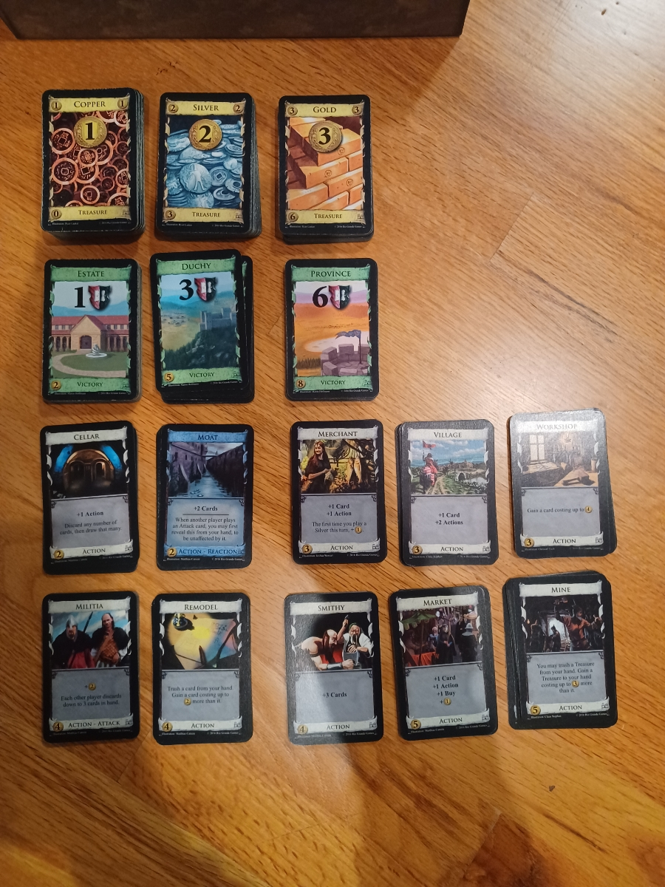
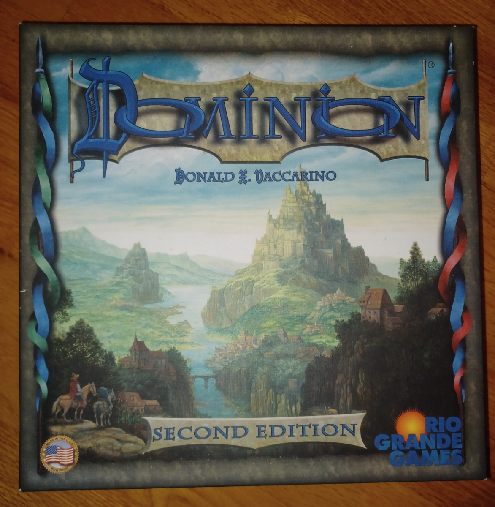
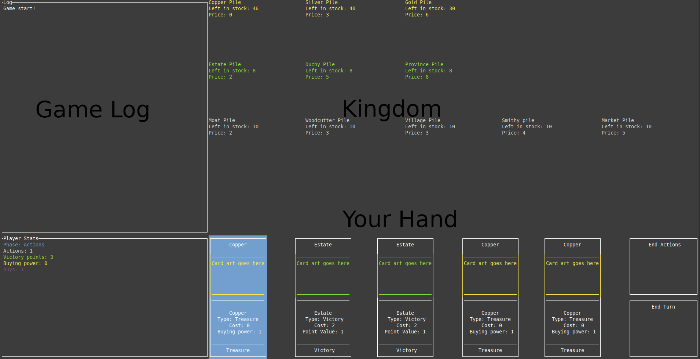
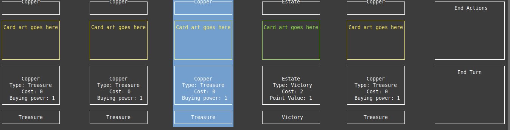
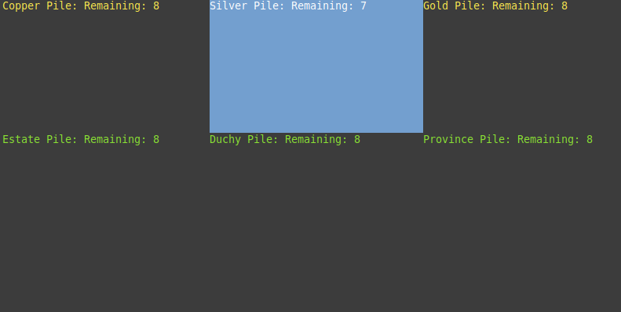
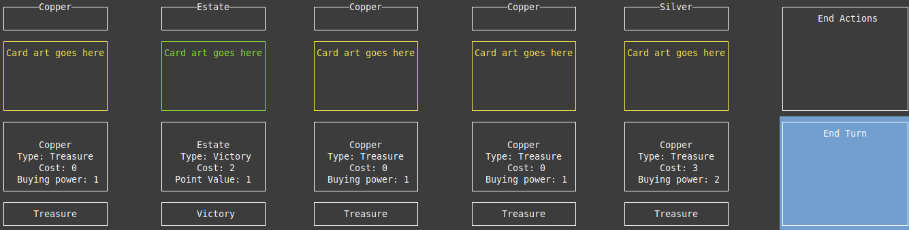

# Dominion in rust

Dominion is a very popular deck-building card game which requires you to use a variety of cards to try and gain points faster than your opponents. This is a playable, but unfinished attempt to implement the most basic game into a rust environment using an extensive backend library, and a frontend library called Ratatui - [Link](https://ratatui.rs/)

Dominion is created by the amazing Donald X. Vaccarino, and published by Rio Grande games.

This software is created for educational purposes only.

## Table of contents
1. [Descrption](#description)
2. [How to run](#how-to-run)
3. [How to play](#how-to-play)
    * [Controls](#Controls)
    * [Objective](#objective)
    * [General rules](#general-rules)
    * [Card types](#card-types)
    * [Sample two turns](#sample-two-turns)
    * [Demo Walkthrough](#demo-walkthrough)
4. [Data Types](#data-types)
    * [Number Casting](#integers-vs-unsigned-integers-vs-usize)
    * [Tuples](#tuples)
    * [List structures](#list-structures)
    * [Strong Typing](#strong-typing)
    * [Optional Types](#optional-types)
    * [Enums](#enums)
    * [Derive](#derive)
5. [Difficulties and Solutions](#difficulties-and-solutions)
6. [The good, the bad, and the ugly](#the-good-the-bad-and-the-ugly)
7. [Learning experience](#learning-experience)
8. [Rant](#rant)

## Description


Dominion is a game about building a powerful deck of cards, competing against other players to acquire as many "victory points" as possible.

The game normally consists of two to four players, each starting with a small deck of cards, purchasing several cards to upgrade their deck, until certain piles of cards run out, and the game ends.

This project is an attempted implementation of some cards from the kingdom set [first game](https://wiki.dominionstrategy.com/index.php/First_Game) in Dominion 2nd Edition with a CPU opponent playing the basic strategy of [big money](https://wiki.dominionstrategy.com/index.php/Money_strategies).
|||
|:-:|:-:|
||
<p style="text-align: center;"><i>Photos kindly provided by a friend who owns the second edition. Thanks Margo!</i></p>


## How to run
Release binaries are not currently available. Please compile the program directly from source.

This game has been tested on Linux using XFCE4 Terminal emulator in bash.
The terminal library claims to support windows, but this has not been tested. Use at your own risk.

### Building
1. If rust is not already installed, install it using [these instructions](https://www.rust-lang.org/tools/install).

2. Download the source code from this repository.
3. Unzip the folder.
4. Download Dependencies:
    >cargo fetch
5. Build
    + To build an executable binary:

       >cargo build --release
    
        Run the release by navigating to the target/releases directory, and finding the executable.
    + To run the game directly from source:
       > cargo run

>[!NOTE]
>This game is best played with a large window size. Smaller window sizes may work, but are not recommended, as interior text may be squashed or cut off. A 187x31 window size was the absolute minimum for my screen.


## How to play

### Controls
|Control   | Button |
|:------|:--------:|
|Navigation| arrow keys (↑, ↓, ←, →)|
|Select|                       Enter|
|Card description|                 ?|
|Quit|                             q|


The game is played between three sets of cards per player: Your draw pile, your hand, and your discard. The deck and discard are hidden from the player, as there is no direct interaction between the player and those decks.

Your kingdom starts out relatively weak (Three estates, seven coppers), but can be made strong through newer and more powerful cards. Be wary, however: It is much easier to aquire cards than get rid of them.

The "playing field" is a set of treasures, a set of victories, and a kingdom set.
The kingdom set is a set of (Primarily action) cards that define each game.



### Objective
The objective of dominion is to acquire as many victory points (VP) as possible. You do this by minimizing the amount of useless cards in your hand, and maximizing the number that give you buys, extra cards, and extra money.


### General rules
Each turn is played split into three phases:

|Phase| Purpose|
|:---:|:-------|
|Action|Play action cards to benefit yourself. You start with one action, and once you are out, no more can be played|
|Buy| No action cards can be played at this time. You may play "treasure" cards to increase the amount of money you have on that turn. |
|Cleanup| Place all bought, played, and cards in your hand into your discard, then draw 5 more. If there are no more cards to draw, shuffle your discard, and add it beneath your deck.|

You play by buying cards from the outer "kingdom" piles, adding them to your deck, and using them to buy more expensive cards later. Eventually, you build up a powerful enough hand to purchase "Province" cards, worth 6 points apiece.

### Card types
The "First game" of dominion requires a set of 16 cards, 6 of which are currently working in the game (Treasures and victories).

| Card type     | Use     | Implemented (Y/N) |
| :-------------|:--------|:-----------------:|
| Action        |The primary variation between games. play to get some special effect or benefit. |1/2|
| Treasure      |The static currency in your hand. Used to buy all other cards. |Y|
| Victory       |The game's point measurement system. Consists of estates worth 1, duchies worth 3, and provinces worth 6. |Y|

### Sample two turns
#### Turn #1
At the beginning of your turn, you start with one action, one buy, and zero buying power. You draw four coppers, and one estates.



You have no action cards, so you end your action segment, set down all of your treasures, and purchase a silver, spending 3 buying power. As there is nothing else you can do, as you are out of buys, you end your turn.



Your opponent mirrors your actions, also purchasing a silver.

#### Turn #2
As on your next turn, you draw two estates, and three coppers, you make a simialar decision, playing all your coppers for a buying power of 3, and purchasing a silver.

#### Turn #3
On your next turn, you notice that one of the silvers you purchased has ended up in your hand. 



Bravo! now you have a buying power of 5 instead of 4. As you keep buying cards, you'll get a better, and better yield, until you're able to purchase the green victory cards.

## Demo walkthrough
Link since embedding doesn't work: https://www.youtube.com/watch?v=3Y7vbrcg-gI

<a name="data-types"></a>
# Data types
 Over the course of this project, I was forced to become deeply familiar with the various types of primitives and structures available in rust, both from the standard library, and outside from Ratatui. In total, I believe this project uses at least half of the data types mentioned in Chapter #6. This section of the document is a sample of some behaviors I found interesting, and some correlations to the textbook as well.

### Integers vs. Unsigned integers vs. Usize
To be brutally honest: This is the area in which I failed the hardest. Although it is not possible at this moment in time, if someone managed to get enough cards in their hand, the game would fail. This is because of how I handled casting throughout the program: Or more accurately, how I didn't handle it properly.

Throughout the game, when I was planning things out, and had a much larger scope, I picked integers for some custom struct values thinking "Of course I'd use integer/usize. Why wouldn't I?"

Unfortunately, as I built up the game, it became brutally obvious that I had picked the wrong data type. This was because I wasn't in a position to handle casting errors, and went with the approach of "There aren't enough cards on the board to cause an overflow." Which is currently accurate. But, if one were to expand the game to a large enough extent, there would be an unrecoverable error that shouldn't have existed.

A good example of this is on line #421 of ui.rs where the following is currently written:

```rust
app.game_nav_data.card_selected = app.game.get_player_character().get_hand().len() as u8 - 1
```

This is a point where, for all intents and purposes, I should've used a usize, as I was always referring to the player's hand vector, which always returns a usize. Changing the type would've made it much easier to process data, without risking cast errors.

### Tuples

For the most part, tuples in programs are generally to be avoided. However, something interesting happened that I wish to share, and found quite refreshing. At one point in my code (Line 203 in game_manager.rs to be exact) I decided it was a fine time to be lazy, and return the pile data as a tuple rather than as a custom struct. This, surprisingly enough, worked fine, and was more stable.

Later, I found out I needed to send more data up to the UI, so I modified the tuples a little bit. I fully expected this to break my UI code, as there were more fields than originally intended. However, because I was referring to them as tuples at indeces, the code remained intact, and didn't break despite the changes.

If I had the chance, I would go back and replace several of my difficult-to-maintain structs with tuples, as they would've made a lot less overhead, and easier code to maintain.

### List structures

The most complicated data type that I created in this program was the player character. This is because they are required to manage four Vectors of boxed cards, a reference cell to a board, and several variables determining their ongoing state. Specifically, they were often complicated because of their Vectors pretending to be stacks whenever it was convenient.

In dominion, the game is usually made up of three "card areas": The deck, where you take cards off the top, your hand, where the cards you can play are, and the discard, where cards you're done with are, and you reshuffle into your next deck.

To simulate this in a computer, you need two VecDeques, and a vector. The two VecDeques will behave like stacks, until it's time to count cards or shuffle. Why? because certain cards in dominion require you to access both ends of the discard and deck. If you try and do that with a Rust Vec\<T>, you won't enjoy it very much. The alternative is a VecDeque, which allows you to insert from both ends. In the end, this was my solution, and I was left with a much more complicated VecDeque, that could be inserted from both ends, but had to be flattened whenever it needed to be shuffled.

### Strong typing

Rust is very, VERY, **VERY** strongly typed. Rust behaves this way because it believes in static allocation for all local variables, and all variables having owners. These two things make it working in combination make rust strongly typed, as handling errors when changing types, or creating types is non-optional, and the compiler will complain if you try and do it improperly.

### Optional types

The vision of "Composition over inheritance" gurantees that you will need to play with optional data types throughout your experience with rust. When I originally read this chapter, I honestly thought "That's just pushing the issue down the road. It doesn't solve anything, and will simply make problems for you later, after you have to check a variable ten times to see if it's empty." My opinion, despite working with Option\<T>, has not changed. However, I can now see its place in languages as a type: It clearly state "I might, or might not be here," instead of being forced to pair a boolean with the variable wherever it goes. Overall, I can see myself using optional a lot more in the future.


### Enums

Enums in rust serve a much, much larger purpose than anything else in the codebase. I don't fully understand it yet, but will try to explain it:

Each enum can encapsulate its own type, and get information based off of what you pull into it. They aren't constants in the way that the book describes them, they're something more, that can have methods implemented and added to them. It's rather insane the possibilities this poses, but, given the chance, I would have certaintly studied them more before embarking on this project.

If each enum can have its own methods and options, it opens up a whole new world for convenient processing: You can have enums containing a value, parsing another value to change itself. In fact, this is what I believe Ratatui does multiple times. Needless to say, there is a lot of depth to enums in rust.

### Derive
One last note: Throughout my programming experience with rust, I was surprised to find that the "derive" directive was required so much. Originally, I thought it was a sign of laziness, as the programmer couldn't be bothered to implement the function, but it actually turned out that rust doesn't do type equivalence, replication, or even debug symbols if you don't ask it to. I thought that was especially interesting after I realized it, and was left wondering why other languages didn't try something similar.


# Difficulties and solutions

I expand upon this more in "The good, the bad, and the ugly," but this project required an amazing amount of work to ensure the borrowing rules for rust were followed. 

One major issue that I encountered was the game board. In particular, the main buying area is supposed to be shared between the game, players, and the display. However, Rust only lets one piece of code borrow an object at a time mutably. To solve this, I had to use a Rc\<RefCell\<board\>\> object. This is an object specifically designed for enforcing borrow rules at RUNTIME rather than at compilation time. This makes it so that if any object wants to borrow the object, it has to request it, then do its mutation, and then stuff it back into the cell. This made it possible to split the one object between four different places without offending the compiler.

## The good, the bad, and the ugly

### The good
For once in a long, long time I was actually able to be creative with the code I write. It's a feeling I don't get to experience often, and this was extremely refreshing after a long quarter.

I particularly enjoyed working with a terminal renderer for the first time, as while ratatui does help you write interfaces relatively easily, it is by no means a easy-pass to the finish. All keyboard input, graphics, sizing, and layout is still done by you, in code, giving you both a lot of control, and a lot of work to do.

### The bad

The main downside to this project was that it was required to be written in an insane rush with little time, and so many features had to be cut out. When I initially pitched the idea of dominion, I expected to have *slightly* more time to work on it, but had my time sapped away by other, less interesting projects that were required. This game has an insane scope, endless possibilities, and still isn't as fun as it could be.

### The ugly

On various occasions, I have been approached by normal people and asked "Why do you behave so much like a robot?" The answer is projects like this. 

#### 1. Borrowing
From now, until the day I die, when a person asks to borrow something from me, I will ask "do you need a mutable or immutable reference?" Rust has such strict rules on what can and can't be borrowed, you'd think the designers worked in a bank with kleptomaniacal employees. Want a reference to something you really need in order to get a basic function working? Well, following a joint session of Murphy's law, and the Rust diplomatic argument passing association, we have received the following statement: "You can pound sand for all we care."

#### 2. Documentation and architecture
The user interface, as it currently stands at 12:01 PM on Sunday, is an absolute nightmare to deal with. This isn't because the UI library, or the methods I built for it are bad: It is a direct result of the complex access control and architecture that rust doesn't document. Given a few more days, I would easily break apart and put back together the entire backend library, if only to make it more adherent to the hidden standards of rust.

Things like how to build external libraries, the common methods needed for objects, best practices for data types, access control, and several other things are completely absent from the rust wiki. Now, this could be due to the language's youth: This is still a relatively new language, and not much is going to be known about it yet. However, once I'm five steps deep in implementing a library is not the ideal time to find out It's all incorrect and the entire frontend will have to dance around improperly built objects for the rest of time.

#### 3. Polymorphism, or the lack thereof
On a personal note: While the theory of "Composition over inheritance" has its merits, rust makes this an absolute nightmare with how much unusable data is floating around an application. Want to build a complex object that needs to work with three lower-level objects? Well, you need to specify the fields for every. single. parameter. What's that? You can nullify them using "Option<>"? Well, no, you can't, because local variables need to be statically allocated, so it takes up the same amount of space in memory anyways. Besides, even if you did, would you want to check every single parameter using a match or unwrap? No. A world where I have to composite a complex object is a world I will despise if I am ever forced to work in it.

## Learning experience
From my perspective, this is the hardest project I have ever taken on. Not because it was required, but because I wanted to. Every single object, variable, implementation, and struct required planning, calculation, and reviewing the rules of rust, all for it to come crashing down later when  I wanted to do "One simple thing" that broke every rule in the book.

Overall, however, a LOT of learning about rust, control structures, and complex data management was done. Here is a brief list:

* Learned about the rules of borrowing, borrowing mutably, and references.
* Flash-learned the general structure of a TUI, and how to propagate calls both up and down the stack.
* Learned about rust libraries, and how to, and not to organize them so they are visible to other packages.
* Got to implement a solution of shared RefCells.
* Became deeply familiar with rust syntax decision for variable names and conditionals.
* Understood the several helper methods of rust, and how rust objects are structured in a way to make them easy to create and use.
* Truly pushed the limits of how much code I can write in four days.

## Rant
This project started ~6 months ago, when I found out all the online simulators for this game had broken and I wanted to build my own, and was recommended to try rust as a new language. After about four days of fighting rust, I realized rust didn't have several of the features I considered intrinsic to dominion **(Polymorphism)**. Frustrated at four days of wasted vacation, I resolved to try again, later, in a different language. 

When I heard we were to make a game I naively thought: "Great! I'm experienced with this stuff, have a solid written base, and can write something better than most other people can without too many issues." Boy, was I wrong. Most of this code was written in about 4 days (Around 50 hours total is my best estimate). As a result, a lot of stuff I really wanted to implement is still lying around. I'm hoping to implement a whole bunch of those features by the end of the day, but want to submit a completed version in case murphy's law breaks loose. If you find unused variables or structs around the codebase, that's why: 

This is the product of most of that planning and effort: It's unfinished, has a few glaring holes, but is completely playable and has an ending. Am I happy with it? No. There's so, so much more I want to build for this, but I'm out of time. 
